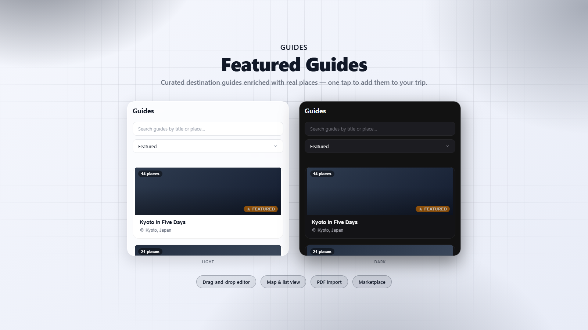

# Featured Guides

Curated destination guides enriched with real places to explore, with one-tap add straight into your trip.

## What it does

Featured Guides adds a standalone **Guides** page to TREK's navigation — a
browsable library of curated destination guides, independent of any single
trip. Each guide is built from an **ordered list of content blocks**, the
same idea as a modern page editor: headings, body text, quotes, images,
links, dividers, day markers, embedded references to other guides, and rich
place/activity cards — added, edited, deleted and **drag-reordered** freely
by an admin.

Creating a guide starts with a short "Configure your guide" step: a title, a
location, and a template — **Blank** (freeform), **List** (a flat set of
places with no day structure), or **Itinerary** (pick a number of days and
that many **Day** blocks are pre-created immediately, so the guide's shape
is visible from the start). Guides start as a **Draft**, visible only to
admins, until explicitly **Published** — only published guides appear in the
browsable list for everyone else.

Typing a **Location** checks it against OpenTripMap in the background (if the
admin has their own API key set — see Setup) and shows what it resolved to, or
a warning if nothing matched. It's a nudge, not a hard rule — saving with an
unrecognized location just asks for confirmation first, since OpenTripMap
doesn't know every neighbourhood or region someone might legitimately type.

An admin builds a guide's content from an **"+ Add item"** menu offering
every block type. A **Place** block has three ways to fill it in:

- **Manually** — type in the name, description, rating and tips, optionally
  attach a photo from the admin's own device, and pick a **category** from a
  fixed, colour-coded list (Activity, Attraction, Bar/Cafe, Beach, Hotel,
  Nature, Other, Restaurant, Shopping, Transport) — the same colours show up
  as a badge on every place card. Places imported from OpenTripMap, a
  Collection, or a PDF get bucketed into this same list automatically from
  whatever category they arrived with.
- **Search OpenTripMap** using the admin's own API key — search resolves the
  destination to coordinates, lists nearby points of interest, and importing
  one pulls in its name, category, address, a Wikipedia-derived description,
  a popularity rating, and a thumbnail photo where OpenTripMap has one.
  Imported data (including the photo) is cached in the plugin's own database,
  so browsing a guide never triggers a live API call — only an admin's search
  and import does, against that admin's own key.
- **From one of your TREK Collections** — browse a collection you've already
  saved places into and pull any of them straight into the guide.

An **Image** block is uploaded straight from the admin's device (no external
hosting involved); the guide list's cover photo is taken from the first
place or image block that has one, falling back to a generated colour cover
otherwise.

Guide detail pages show a sticky timeline strip of pills for every **Day**
block so travellers can jump straight to a day, alongside a connecting rail
down the page.

An admin can **Feature** any guide (a star toggle on its row in the
management list) to pin it to the very top of the browsable list, ahead of
everything else — the plugin's own "featured" list, not just a chronological
one. A guide can be **Duplicated** in one click to start a variant of an
existing itinerary instead of rebuilding it from scratch — the copy always
lands as its own unpublished, unfeatured draft, titled "(Copy)", regardless
of the original's own status. While editing, **Preview** shows the guide
exactly as a traveller would see it — including a still-unpublished draft —
without leaving the editor or having to publish first; a small banner makes
clear it's a preview, and one click returns straight back to editing. The
guide-management list also has its own search box, separate from the public
one, for finding a guide to edit among many.

Any traveller browsing a guide can add a **Place** or **Activity** block
straight into one of their own trips with a single click: pick the trip from
a short list and it's created in that trip's place pool, ready to be
scheduled onto a day.

A **Plan a trip** button on every guide goes further: pick a start and end
date and it creates a brand-new trip for that time frame, using the guide as
a template — every place and activity in the guide is added, and each one is
scheduled onto the matching calendar day wherever the guide's **Day** blocks
say it belongs (a place before day 1, or past the date range you picked,
still gets added — just left in the trip's place pool instead of scheduled).

A **Save to Collection** button (shown whenever a guide has at least one
Place) saves every Place in the guide into one of your own Collections —
an existing one, or a brand-new one you name on the spot — separate from
adding places into a trip. It's the reverse of importing places *from* a
Collection into a guide while curating one. Each individual **Place**/
**Activity** card also gets its own **Save** button right next to
**Add to trip**, for saving just that one place instead of the whole guide.

Note: there is deliberately **no live map**. TREK plugins run in a sandboxed
iframe whose content-security policy blocks loading map tiles from any
external host, so a pannable/zoomable map isn't something a plugin can do —
only a non-interactive static image would be possible, and this plugin
doesn't attempt one.

**Import a guide from PDF** — built for Mindtrip-style "inspiration" exports
and similar trip-guide PDFs, and for a trip exported straight from **TREK
itself** (Trip → Export → PDF). A TREK export is recognized and parsed
directly — no AI needed, and no guessing at coordinates: every place already
carries its real lat/lon and one of this plugin's own ten place categories,
straight off the export, so it lands with accurate coordinates from the
start. Flight/check-in/check-out/accommodation-summary/booking-note sections
in a TREK export aren't imported (those are trip bookings, not places — the
hotel itself still comes in as a normal place). An admin picks a PDF; the
text is extracted right there in the browser (a bundled PDF reader — the
file itself never leaves the iframe), then, for anything that isn't a TREK
export, structured into a guide using the admin's own configured AI
provider. If no AI provider is available — not configured,
or this TREK instance doesn't support it — it automatically falls back to a
deterministic, no-AI text parser that recognizes the same place/category/
address pattern these exports use — including entries with no explicit
category word at all (just a city/region line), and restaurant-type entries
tagged with a cuisine like "Korean" or "Italian" instead of the word
"Restaurant" — so the import still works, just with a somewhat less capable
structuring pass. A day's own short theme line ("gangnam day") is picked up
as that Day block's title where the export has one, and both passes get a
cleaned-up version of the extracted text first — a trailing "Map" legend
section and justified-text/dropped-character spacing artifacts are stripped
before anything is parsed. Either way, the result — title, location,
overview, and every place found (grouped under **Day** blocks if the source
PDF has them) — always lands as a **Draft** for review, never auto-published.

The PDF's embedded photos are pulled out too, in the same browser-only pass —
a cover/hero photo (typically the export's intro banner) becomes the guide's
first **Image** block, and every other real photo found is matched, in the
order it appears in the document, to the places found in that same order.
It's a best-effort, positional match rather than a guaranteed one-to-one
pairing, so a photo can occasionally land on the wrong neighbouring place —
worth a quick check before publishing. If an admin has an OpenTripMap key set
(see Setup), imported places also get a best-effort pass at real coordinates:
the guide's destination is geocoded once, everything OpenTripMap knows about
nearby is pulled in one sweep, and any place whose name matches gets that
point. Anything still without coordinates after that — most hotels,
restaurants and small local spots, which OpenTripMap doesn't carry — gets a
second pass instead of being left blank: its extracted **address** is looked
up directly against OpenStreetMap's Nominatim geocoder (free, no key needed).
A guide imported before this existed (or one where some places still didn't
resolve) can be fixed retroactively — **Manage guides → open a guide** shows a
**Find missing coordinates** button whenever it has any place still lacking
one.

**Import a guide from a trip** — a **From a trip** button on the
guide-management screen skips the PDF step entirely: pick one of your own
trips and its places (real coordinates and categories included) come
straight in as a new Draft guide, grouped by day where TREK's own itinerary
already has an assignment. This reads trip data directly through TREK's own
`ctx.trips` API — no new permission needed beyond what "Add to trip" already
uses. It's newer and less exercised than the PDF path: worst case, if a
particular TREK version's data doesn't match what this plugin expects, every
place still comes in (that part's guaranteed), just without day grouping or
coordinates, as a "List" guide instead of an "Itinerary" one.

**Marketplace** — a **Marketplace** button on the guide-management screen
lists ready-made guides published for anyone using this plugin, fetched
straight from a public GitHub repo (no server round-trip, no account needed).
**Import** pulls one in as your own, editable, unpublished **Draft** — never
auto-published or auto-featured — and since it becomes a normal local copy,
deleting it and importing again later works exactly like you'd expect. Any
admin can also feed the marketplace: **Export** on one of your own guides in
the management list produces its JSON in a copyable box (plugins can't
trigger a real file download from inside their sandboxed frame — there's no
way around a click-to-select-all-and-copy-it-yourself step), ready to commit
into a marketplace repo's `guides/` folder, alongside a suggested
`marketplace/index.json` entry for it. A marketplace guide can carry real
photos, easily large enough on its own to trip the host's request-size limit
in one go — importing sends it in several small pieces instead, the same
fix already used for a big PDF import.

The marketplace list is built for browsing a real catalogue, not just a
handful of entries: a search box plus a **location filter**, a small cover
photo and author credit on each entry, and newest-first ordering when an
entry sets its own `addedAt` date. **Preview** shows what's actually inside a
guide (place names, categories, day count) before committing to import it.
Already pulled a guide in before? Its card says so — and if the author has
since refreshed it (a newer `updatedAt` than what you imported), it offers an
**Update** instead of a plain Import; that always creates a fresh, separate
draft rather than silently overwriting whatever you've already edited, so
your own changes are never at risk. Checkboxes and an **Import selected**
action pull in several guides in one go, handy for stocking a brand-new TREK
instance with a whole starter library at once. One malformed entry in
`index.json` — a typo, a bad merge — is skipped on its own rather than
breaking the entire list for everyone.

A second **Templates** tab in the same modal (same search, filter, preview,
and bulk-import machinery) offers reusable starting *skeletons* instead of
complete guides — a day structure or section layout with a few placeholder
"Example:" places already in place, meant to be imported over and over for
different trips rather than tracked as "already imported." Four ship with
this plugin out of the box: a 3-day **Weekend City Break**, a category-
grouped **Foodie Guide**, a 5-day **Road Trip Itinerary** with a driving note
for each leg, and a day-less **Inspiration Board** for gathering ideas before
you've committed to dates. Contributing your own works the same way as a
guide, just saved under `marketplace/templates/` with its own `index.json`
instead of `marketplace/guides/`.

## Screenshots

Show it in context. Commit a `docs/screenshot.png` — it's what the store card
shows. A 16:9 image (e.g. 1600×900) with your plugin centred and some margin
looks best (the card crops the edges).

## Permissions

| Permission | Why |
|---|---|
| `db:own` | Stores every guide and its curated places — including any imported thumbnail photo — in the plugin's own database, the library that browsing reads from. |
| `http:outbound` | Marker permission required alongside the specific outbound host below. |
| `http:outbound:*.opentripmap.com` | Lets an admin's guide-editing search reach the OpenTripMap API (and its own thumbnail-image host) to look up destinations, points of interest, and photos, using that admin's own key. |
| `http:outbound:nominatim.openstreetmap.org` | Lets an imported place that OpenTripMap couldn't match get geocoded from its address instead, via OpenStreetMap's free Nominatim service — no key needed, and it's only ever used as a fallback for places OpenTripMap's own sweep already missed. |
| `http:outbound:raw.githubusercontent.com` | Lets the guide **Marketplace** list and import ready-made guides published as plain JSON in a public GitHub repo — no key or account needed, and nothing is sent there; it's read-only. |
| `db:read:trips` | Lists the signed-in user's own trips so they can pick which one to add a place into, or (for an admin) which one to import as a new guide. |
| `db:write:places` | Creates the selected place inside the chosen trip's place pool when a user clicks "Add to trip" or "Plan a trip". |
| `db:read:collections` | Lets an admin browse their own saved Collections and pull a place from one straight into a guide. |
| `db:write:collections` | Lets **Save to Collection** save a guide's places into one of your own Collections, new or existing. |
| `db:create:trips` | Lets "Plan a trip" create the new trip itself, for the time frame the user picked. |
| `db:write:days` | Lets "Plan a trip" create the day rows it needs to schedule the guide's places onto the right calendar date. |
| `db:write:itinerary` | Lets "Plan a trip" assign each imported place onto its matching day. |
| `ai:invoke` | Lets an admin's "Import from PDF" structure the extracted text into a guide, using that admin's own configured AI provider. |

## Setup

1. Install the plugin — no setup is required just to browse guides or add
   places to a trip.
2. Any admin who wants to search OpenTripMap while curating a guide should get
   a free API key at [opentripmap.io](https://opentripmap.io/product) and paste
   it into their own **OpenTripMap API key** field on this plugin's settings
   page (per-user — each admin uses their own key; manually-entered places
   never need one).
3. Open the **Guides** page from the main navigation. Admins see a
   **Manage guides** button to create guides, build their content block by
   block (places by hand, by searching OpenTripMap, or by picking from one of
   their own Collections — the last option needs the Collections addon
   enabled), **Import from PDF** a Mindtrip-style guide export (needs an AI
   provider configured on the admin's own account), pull a ready-made guide
   in from the **Marketplace**, and **Publish** a guide once it's ready;
   every user sees the published guide library and can add any place or
   activity into one of their own trips.

## License

MIT
